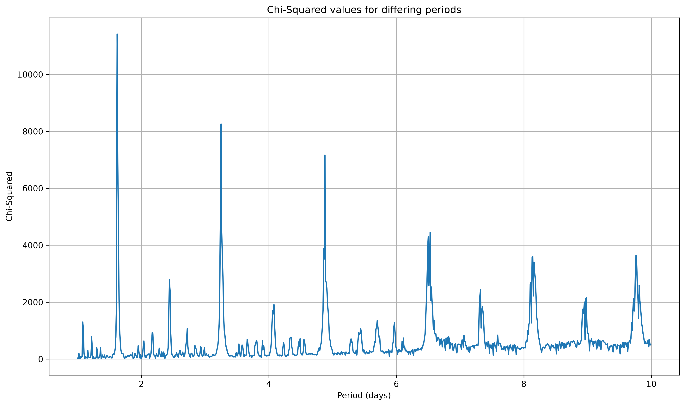
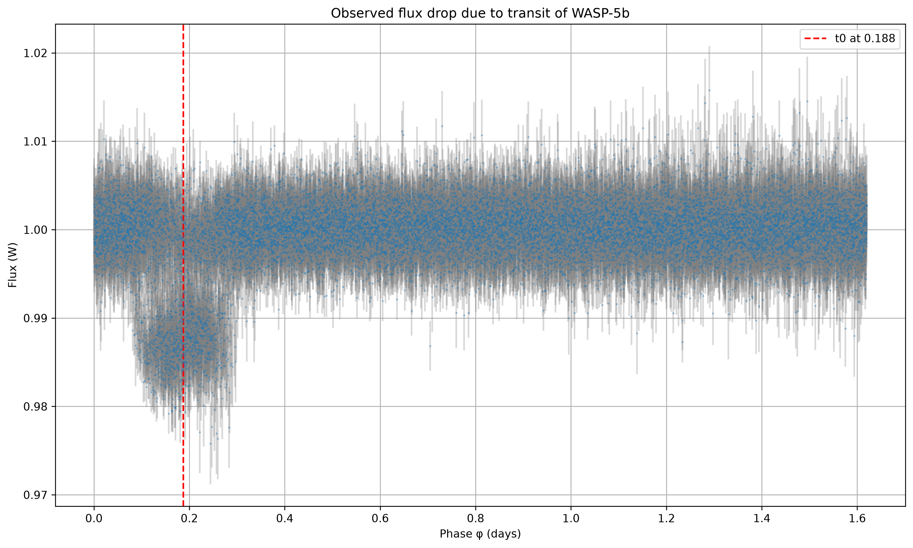
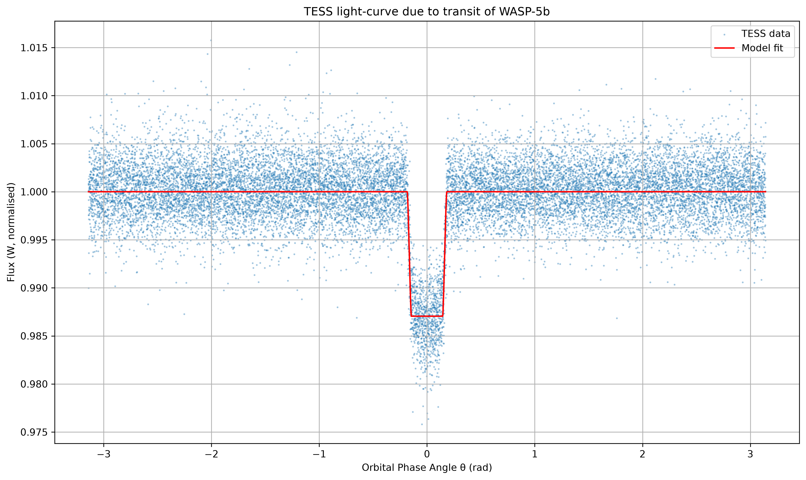

# WASP-5b Exoplanet Transit Detection & Parameter Inversion

An end-to-end astronomical data pipeline implemented in Python to detect exoplanetary transits from NASA TESS photometric time-series data and constrain planetary physical parameters using non-linear occultation modeling.

---

## Overview

- **Signal Recovery:** Implemented a custom Box-Least-Squares (BLS) search algorithm from first principles, utilizing inverse-variance weighting, phase-folding, and dynamic binning across trial periods ($1.0$ to $10.0$ days).
- **Physical Modeling:** Fitted an analytic uniform-source transit model (Mandel & Agol formalization) to the folded light curve using Levenberg-Marquardt non-linear least squares (`scipy.optimize.curve_fit`).
- **Parameter Inversion:** Derived the planetary radius ($R_p$), orbital period ($P$), mid-transit epoch ($t_0$), and orbital semi-major axis ($a$) in physical units.

---

## Key Inferred Parameters

| Parameter | Inferred Value | Literature Comparison | Units |
| :--- | :--- | :--- | :--- |
| **Orbital Period ($P$)** | **1.628432** | ~1.6284 | days |
| **Mid-Transit Epoch ($t_0$)** | **2088.301651** | — | BJD / days |
| **Transit Depth ($\delta$)** | **0.007** | ~0.007 | normalized flux drop |
| **Planetary Radius ($R_p$)** | **$8.550 \times 10^7$** | — | m |
| **Radius Ratio ($R_p / R_{\text{Jup}}$)** | **1.196** | ~1.17 – 1.25 | $R_{\text{Jupiter}}$ |
| **Semi-Major Axis ($a$)** | **0.030671** | ~0.027 – 0.031 | AU |

The derived values confirm the sub-stellar companion to be a classic **Hot Jupiter** in a tight, short-period circular orbit.

---

## Visualizations

### 1. Box-Least-Squares (BLS) Periodogram
*Detection statistic ($\Delta\chi^2$) as a function of trial period, displaying a prominent primary detection spike at $P \approx 1.62$ days along with sub-harmonic peaks.*



### 2. Phase-Folded Transit Detection
*Raw TESS photometry phase-folded on the detected period, with the vertical dashed marker denoting the mid-transit epoch ($t_0$).*



### 3. Analytic Occultation Model Fit
*Non-linear least-squares fit of the geometric occultation model overlaid on the phase-folded TESS data.*



---

## Methodology & Formulation

### 1. Box-Least-Squares (BLS) Search
1. Timestamps $t_i$ are phase-folded according to $\phi_i = t_i \pmod P$.
2. Baseline flux $\hat{f}$ is determined via optimal weighting $w_i = 1/\sigma_i^2$:
   $$\hat{f} = \frac{\sum_i f_i w_i}{\sum_i w_i}, \quad T = \sum_i w_i$$
3. Bins of width $\Delta\phi = 0.125$ days ($\sim 3$ hours) evaluate transit depth $\delta_j$ and significance $\Delta\chi^2_j$:
   $$\delta_j = \frac{-S_j T}{R_j (T - R_j)}, \quad \Delta\chi^2_j = \frac{S_j^2 T}{R_j (T - R_j)}$$
   where $S_j = \sum_{i \in j} (f_i - \hat{f})w_i$ and $R_j = \sum_{i \in j} w_i$.

### 2. Geometric Transit Modeling
Unobscured normalized flux $F(p, z) = 1 - \lambda(p, z)$ is modeled as a function of normalized separation $z = d/R_*$ and radius ratio $p = R_p/R_*$:
- **Out of transit:** $\lambda(p, z) = 0$ for $z > 1 + p$ or $\cos\theta < 0$
- **Total ingress:** $\lambda(p, z) = p^2$ for $z \le 1 - p$
- **Ingress/Egress:** Analytical disk overlap evaluated using circular segment geometry.

---

## Repository Structure

```text
├── ProjectBLS.ipynb      # Main analysis notebook (BLS pipeline + non-linear model fit)
├── wasp-5b.txt           # Calibrated NASA TESS photometric time-series dataset
├── periodogram.png       # Generated BLS periodogram
├── fluxdrop.png          # Phase-folded light curve plot
├── transit_fit.png       # Fitted transit profile
├── requirements.txt      # Python dependencies
├── .gitignore            # Git exclusion file
└── README.md             # Project documentation